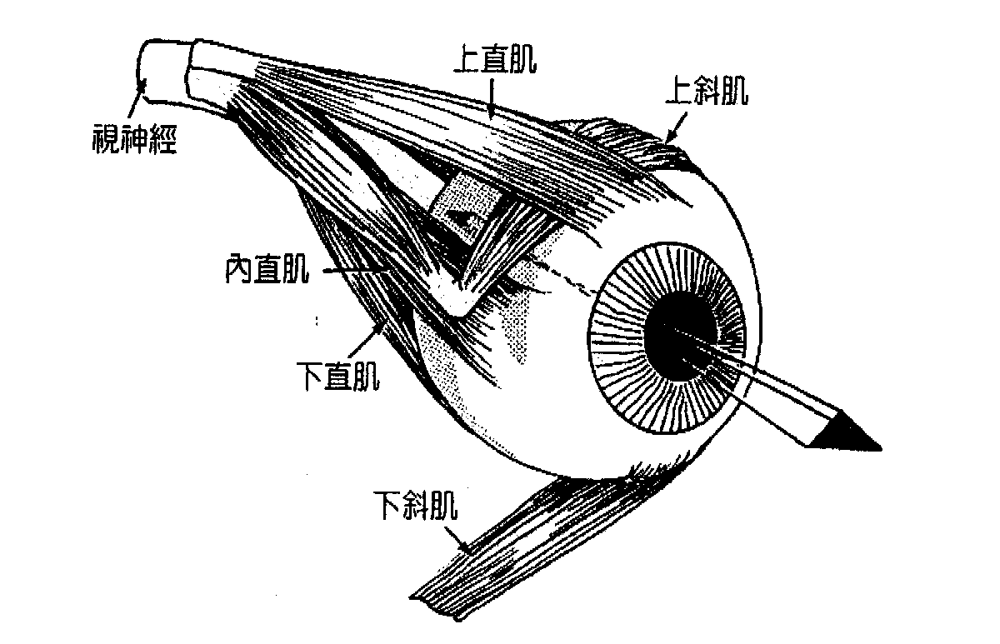
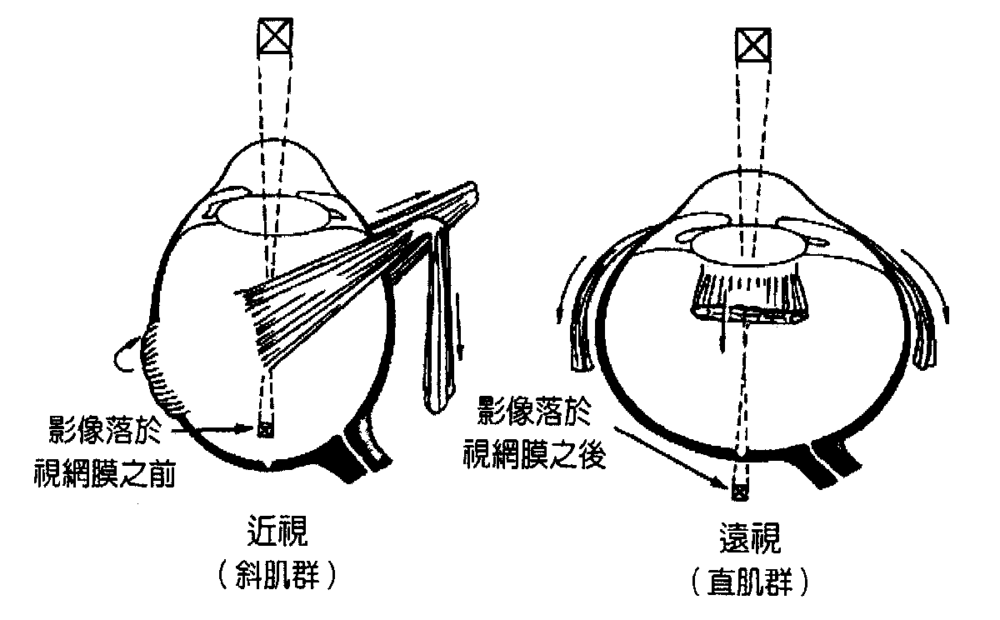
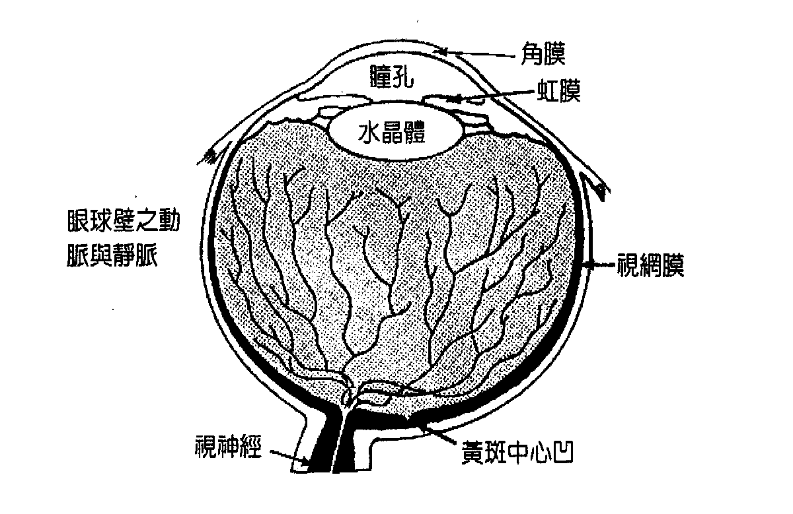
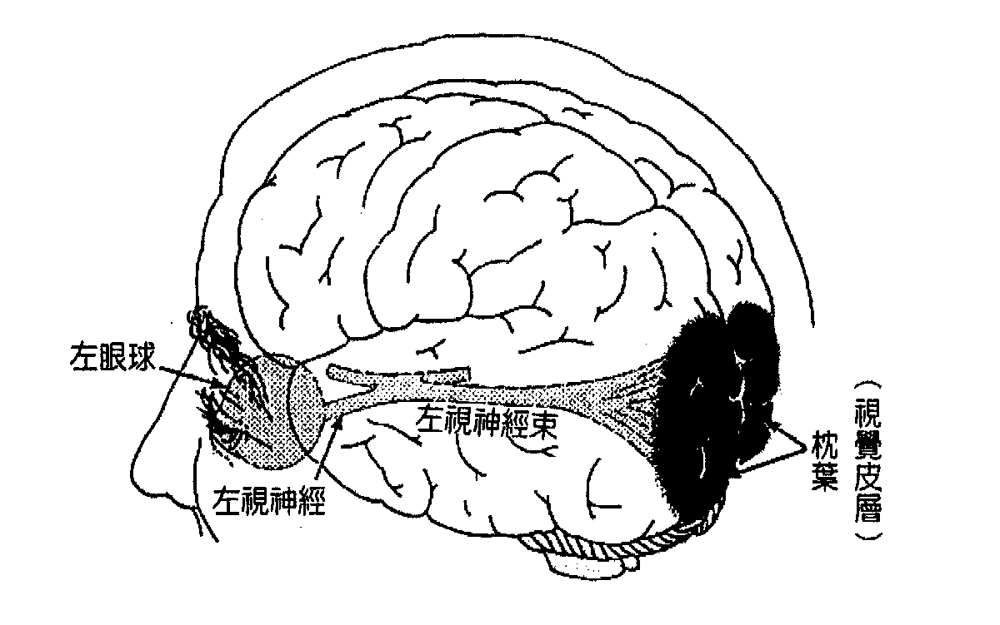

# 第 1 章 视觉之喻

凝视某人的眼睛，你将看见他们真正的模样。我们或许能勉强自己微笑、说些他人想听的话，但真相永远就在我们的双眼之内。眼睛无法说谎。我们身体的眼睛不仅是外在感知的器官，也和我们的内在感知有关。我们的语言中充满了各式各样关于视觉的比喻：

「他真是短视」

「她真有远见」

「他拒绝看清楚正在发生的事」

「我了解了」（原文为 I see，字面意义为「我看见了」）

「他们无视于他的所作所为」

「他不愿直视这个问题」

诸如此类——但是这些表达方式都不是关于生理视觉。所以，我们的视力和存在方式之间有什么关系呢？

视力不仅是和视觉敏锐度有关的生理程序，更是一种多层次的功能，会影响我们这个生命体存在的情绪与心理状态。视力同时与人格连结，每种视力受损亦和特定人格类型有关（请注意：如果你跳过了本书的引言，那么我建议在这个阶段回头去读那个部分——你会看到一个清楚的案例，说明外在的视力如何反映出内在的运作程序）。

所有近视的人都有共同点，远视的人也都有一个特定的人格特质，而所有罹患散光的人生命中都得处理一个类似的问题。每一类视力受损都代表人在与环境互动时承受压力的一种方式，一种不「轻松」（not ‘at ease’）的方式。

某些人说压力造成了所有的情绪与生理失衡——确实，压力造成庞大工时的损耗，医界也承认它确实关系到疾病（或说 dis-ease，「不轻松」）的产生。压力以许多型态储存于身体，包括特定肌肉的紧绷或收缩。压力型头痛和紧绷的肩膀是两个常见的例子。

因此，我们可以说，生理的紧张是储存在身体肌肉内部的情绪或心理紧张。特定肌肉群的紧张关系到特定的情绪与心理状态。换句话说，你在「哪里」感觉到紧张乃是关系到你「为何」感到紧张。就视力而言，和不同的视觉失常有关的是特定眼外肌群（extra-ocular muscles，围绕着眼球的肌肉）的过度紧张，以及特定的情绪模式。

每颗眼球外围绕有六条眼球肌（参见下边插图）。我们用这些肌肉来推动眼球朝向不同方向移动，有段时期人们认为这是这些肌肉的唯一功能。不过，后来发现，这些肌肉的力量比起完成这些动作所需的力气，强大超过百倍。既然人体的结构与功能有密切关系，这些肌肉显然必定有其他功能。确实如此。

眼外肌的另一功能就是配合水晶体（晶状体）组成眼球的对焦机制。这些肌肉让眼球能根据我们所观看的事物、以及我们的想法和感受来伸长或缩短。如此一来，眼睛的运作就像可变焦的风箱式照相机，而不是固定焦距的盒式照相机。

四条直肌群（Rectus Muscles）将眼球直直地向眼窝拉，使眼球缩短（请见下边插图）。这些肌肉的过度拉紧会造成远视。这类紧张表现在情绪上则是隐约而持续的愤怒感或是罪恶感（亦即针对个人自我的愤怒）。这种经验也可能是感觉自己脱离了自我、并聚焦于某个外在的形象或角色，而非聚焦于自己真正的样貌。在远视的人身上，能量会往外扩展，好让事物无法进入，甚至把东西向外推离。远视的人可能感觉自己在某些地方不如他人那么重要。

两个眼球分别被两条肌肉像腰带一样束着，这组肌肉称为斜肌（Oblique muscles）。这些肌肉拉紧时，便会挤压眼球使之伸长。这些肌肉若过度紧张，便会造成近视，而这样的压力表现在情绪上的经验为：躲藏在自己的自我之内，向内退缩。这样的经验包括忧虑、恐惧、不信任、感觉受到威胁、或者不敢做自己。有可能这类经验全都会出现。

不同肌肉压力不均会使得眼球受到不均的挤压，被此力道拉扯的眼球不再呈现圆形，因而造成散光并扭曲所见的影像。这样的人可能感觉迷失、不确定、或者对自我价值观（到底自己真正想要什么、真正的感觉如何）感到混淆。来自「外在」的价值被纳入「内在」，以个人感到不自然或不真实的方式。这种状态产生的压力不仅出现在个人的意识中，也会出现于眼睛的肌肉上。

视力受损之所以出现在人的生活，是因为人们面对环境感到压力，因为他们无法看清楚环境——眼睛或心灵均是如此。如果状况持续，承受这类压力的眼睛肌肉便会暂时「冻僵」，让眼球呈现失焦的状态。由于这些肌肉承受的压力呼应了个人意识内的压力，因此个人也受困于特定的意识状态中。幸好，透过哈达瑜伽（Hatha Yoga）的眼睛运动——类似验光师所谓的运动力训练——这些眼睛肌肉能够得到放松，并因此恢复清楚的视力。

等到眼睛肌肉恢复弹性，眼球就能恢复到自然的形状，视力也能恢复。压力也能从身体与意识释放，让人回归到轻松、清晰、更为自然的存在形式。我们的视力天生就是清晰的，因此回归清晰就是回归我们自然而然的平衡状态，也就是真正做自己。

就算不去专门处理我们眼睛的肌肉，只要处理自己的生活方式，我们也可以回归清晰与平衡。视力隐喻人们观看世界的方式，也和人格有关。只要我们辨认出个人经验内与视力损害有关的元素并将之释放，那么视力便能恢复清晰。只要我们释放意识中过多的压力，我们便能释放眼睛肌肉中的压力，眼球便能恢复自然的形状，因而带来清晰的视觉。

由于每种视力损害都对应特定的人格类型，因此外在视力的改变理应伴随着性格的改变。新旧将会有同样的存在本质，但是「新」会用不同的方式与环境互动——那是一支不同的舞。

这样的改变就像去除一层感知的滤镜（filter）——过去这层滤镜决定各种价值观。我们无需受制于种种我们自知是扭曲的观点，而是去控制它们的显现。我们可以有意识地决定依循并选择我们确知为真的认知，让我们与环境的互动更为成功、并且更符合我们真正的样貌。放下旧有的滤镜，新的价值观将更为明显，其后续效应也将有更深的影响。改变可以很简单——新的、不同的食物、服装、音乐品味！这是来自你的忠于自我并愿意改变。改变或许相当剧烈，关系到事业与人际关系。这类改变听来或许极端，不过它们总是为了你好，最终会导向更大的快乐与自我实现。

视觉改善的方法如未能考量人格改变的层面则其成效也将有限。在视力获得恢复的案例中，相关的人都经历转变的过程，也确实放下某些角色期许。他们变成另一种存在，个性不同，更加真实且以不同的方式观看世界。改善的程度与速度取决于个人有多愿意接受改变、接受新的性格、去成为新的存在，或者应该说，取决于他们是否愿意成为并活出真实的自己。

如果我们想象每个人都被一个能量泡泡（我们各自的认知滤镜）围绕着，那么我们便能了解某些譬喻。

### 近视

近视的人看离自己近的东西比看离自己远的东西容易。他们更加专注于自己泡泡里面的东西，较不关心外面的事物。能量——也就是注意力的方向——朝向内部，远离外部，向内移动并且收缩，因此事物必须靠近才能清楚且轻易地被看见。人的倾向朝向自我，此倾向相当过度，因此「我」比「你」更加重要，而「我们」中的「你」似乎未能获得等量齐观的注意。他们感觉自己的渴望与感受比起他人的渴望与感受更为重要。近视的人通常极度需要隐私，可能会由四周的世界退缩。他们对所处的环境感到心惊，有种想躲入内在的感觉。

对近视的人来说，他们思考的焦点在前方，而这种观点的情感经验是恐惧或不确定感。对未来过度着迷让这样的人无法完全活在当下——活在此时此地——而这种经验的程度与近视的度数成正比。这样的人格可能会有些补偿作用，例如以敌意来掩饰并缩减自己的恐惧，或者勉强做出外向的姿态来掩饰自己躲藏于内在，不过我们在此讨论的是这类外在行动背后的内在动机。

### 远视

远视的人看离自己远的事物比看离自己近的事物清楚。远视的人更关心泡泡外面的事物，较不关心泡泡里面。能量——注意力的方向——向外扩展，推开或顶撞着外在的事物。东西必须拿远点才能清楚且舒服地看见。他们感觉其他人的渴望与感受，比起自己的渴望与感受更为重要。他们极度倾向于他人并远离自我。 「你」比「我」更加重要，而「我们」中的「我」似乎未能获得等量齐观的注意。

近视的人能够轻而易举退缩到自己的内心，但是远视的人很难这么做，因为他们的注意力会持续导向外在。远视的人对他人的生活感兴趣却逃避面对自己的生活。他们的外在形象（他们在别人眼中的样子）被过度强调、被过度认同，其重要性远超过他们的本质——亦即真正的自己。任何的愤怒都可能被压抑，以避免冒犯其他人。思维聚焦于过去，通常带有愤怒与自我辩解，或是一种没做「正确的事」的感觉。他们沉溺于过去，无法活在当下。当然，这种状态的程度取决于个人的平衡以及个人的远视程度。当然可能会有补偿性的行为，例如过度强调自己的圣洁以掩饰罪恶感，或者以超乎常理的仁慈来掩饰愤怒。

### 散光

眼睛散光的人对自己的渴望或感觉不甚确定，这点取决于散光出现于左眼、右眼或双眼。他们的「泡泡」是扭曲的。

以形而上来说，右眼（意志之眼）代表清楚看到自己的渴望，左眼（灵性之眼）则代表清楚看见自己的感觉（对左撇子而言，上述的特性是左右相反）。有散光的人渴望或感觉到对自己确切为真的事物，但他们会认为这样不妥，因此将之改变。他们进而相信假装而成的改变，不再能清楚看见自己一开始真正的渴望或感觉。他们的焦点在于那些渴望或感觉是「应该的」，而不是它们是否为真。因此他们混淆了何者是真正的自己。如果他们不再假装成自己不是的模样，那么他们又是谁呢？

各种视觉失常的组合和前述特质的结合有关。散光可能会和近视或远视结合。当然，具有前述的人格特质不见得会伴随视觉失常，不过对视力受损的人而言，这些特质会特别显著。

近视代表看近的事物特别清楚。远视代表看远的事物特别清楚。尽管极少数人可能一眼近视、一眼远视，但是同一眼不会同时出现两种症状。如果人看远看近都不清楚，这种状况是眼睛调节机制过于僵化，反映出意识的僵化。放松技巧与眼睛运动可以恢复弹性。如此一来，个人也会发现自己的心理程序更有弹性。

我们是能量的存在，能量则是由我们的意识所引导。究极而言，我们能够选择能量在某种情况下该朝什么方向流动。我们可以选择不受过往模式的引导。我们可以改变那些自己知道较不正确、较不理想的感知，并且愿意看见事物的真相，而非透过扭曲的滤镜来看。

泡泡内外的能量流可以改变，泡泡自身本质也可以改变。要记得，这是我们借以感知环境的感知「滤镜」。「阻塞」的滤镜会让我们只以特定的模式来互动及感知。这就像有选择性的镜头，只接受让符合我们选择或接受的基本信念通过，却忽略或拒绝其他的信念。由于我们的行动乃是根据自己所能接收的资讯，因此前述情形会让我们倾向以固定方式回应自己的环境。尽管如此，真正的问题并不在选择性的滤镜，而是我们必须释放情绪滤镜中的扭曲特性。

如果我们保持清晰且站稳中道，泡泡会变得清澈，我们的互动也是如此。当我们处在强烈情绪之中，我们无法保持中道，泡泡也不再清澈，会因情绪之流而扭曲。因为情绪之流让泡泡扭曲，状况会有不同的外貌，而我们也会以不同的方式应对。我们通常能体认自己的观点受到扭曲，有时甚至就在经验展开的同时便能知道。如果愤怒、恐惧、混乱等强烈情绪被「压抑」——就如同视力受损的人所经验到的——那么泡泡当然受到扭曲，不过人们无法体认这样的扭曲。人会认同于扭曲的观点，相信它代表真相，相信它代表真实的自己。然而事实并非如此；那不是他们真实的自我，而是他们在扭曲作用时所显现出的样子。他们可以释放滤镜与自我感知中的扭曲层面，回归真实且清晰的自我。

### 做出改变——从靠近到清晰

近视的人要更加愿意让人看见，要相信让人看见真正的自己是安全的，这样便能将能量导向外在。他们可以学习从别人的眼睛观看自己，去了解别人如何看待自己，这样他们不仅会有由内向外的观点，也能有由外向内的观点。这会让他们有机会走出自我，用不同的观点看事物，并且运用如此得来的额外资讯来扩大自己的互动。

同样重要的是以同理心对待他人。你不一定要认同其他人对你的看法，但是你要愿意去了解他人如何看待你，也要知道其他人对你的观点和你对自己的观点同样重要。事实上，知道其他人的观点或许非常有用。

培养自信心并且选择不再基于恐惧来做决定，这对近视者相当有益。重点是，不要对自己所处的环境感到恐惧或威胁，而是逐渐专注于让自己做自己，让自己愈来愈真。重点是要相信，相信当你做自己「真正想做的事」，那么奇妙的事一定会发生。由于这个过程对我们的「自我」如此重要，因此近视的人也要学习去了解，同样的过程对其他人也很重要，去了解每个人都愈来愈擅长做自己。

### 做出改变——从遥远到清晰

远视的人可以用关心他人的方式来关心自己，借此重新将能量导向内在。重点不是停止考虑他人，而是以同样的方式来考虑自己——愿意为他人做什么，也要愿意为自己做什么。还可能需要有意识地允许自己不带罪恶感地接受——不是取得，而是接受（请注意两者之间的差异）。同样重要的是，你要能表达渴望和感觉——允许自己拥有。在接受时，你无需回馈或拒绝，只要说声「谢谢」并且无条件地接受。这样的接受也包括观念，而且你应该注意自己用什么方式来与事物、观念甚至人保持距离。焦点应转向真正的你，而非你的形象。形象很重要，但是不该因此忽略本质。外在模样并不比真正的感受更加重要，而且人们确实会感激你诚实表达感觉。

你也必须体谅自己。表达爱，不见得需要牺牲。你不一定得走出自己的空间才能获得爱与尊重。这个角色可能很有趣，但是请记得里面的那个人，那个扮演这个角色的存在。从远视者的角度来看，「我们」可以将「我」和「你」等量齐观，「我」也可以被视为另一个「你」，可以彼此分开而且本身就很重要。

### 做出改变——散光

有散光的人每天都要经常问自己：「此刻我真正想要的是什么？我真正的感觉是什么？我觉得什么是真的、是对的？如果我不再想要成为我不是的那个人，那么我又是什么人呢？如果我不再根据他人的标准来活，那我又是什么人呢？ 」如果我不再假装成我一直扮演的那个人，什么是我会以不同的方式来做的？

你可能觉得你真正的样貌是你所处的环境无法接受的。如果这样，重点在于发现这个感觉是真是假：你可以做自己，停止角色扮演。你要不就发现这个感觉是误会，因为你无需角色扮演，要不就发现这个感觉是真的，这么一来你就能选择转换到另一个你能做自己，同时让人接受的环境。无论如何，其结果就是能更加轻易地做真正的自己。

在社会中，我们每个人都能适得其所。如果我们让自己真实不虚，我们就会找到自己的定位，能够以真正的自己为人接受、欣赏。我们不用再假装看不见什么对自己是真实的。我们全都可以允许自己成为真正的自己，可以愈来愈真实。

只要有决心及意志力来改变感知与其相应的实相，任何人都可以改变自己的世界观——心理的观点与身体的视觉——并且回归视力清晰的自然状态。

### 肯定语

我愈来愈自在可以做自己，并且看得更清楚。

我知道自己可以不用眼镜就看得很清楚。

当我清理自己的生命，我的视力也清晰了。
