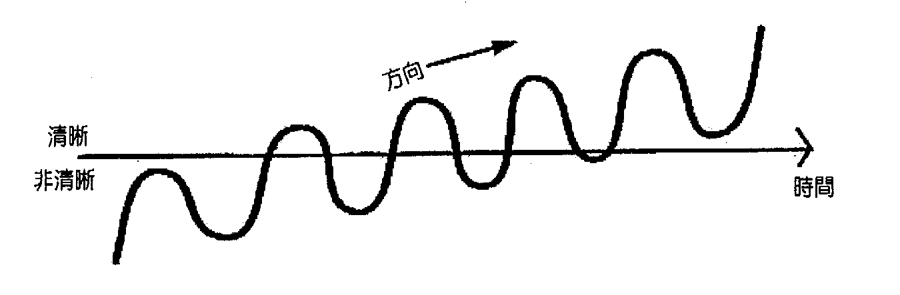

# 第 2 章 回归清晰

如果你已下定决心要改变自己的视力，首先要考虑几件事情。

你必须发自内心深处想要改变发生，你必须愿意做必要的事——可以说，你要将这当成第一优先，甚至视之为生命中最重要的事，至少暂时如此。为了改善视力付出两个月的时间并不为过。在这段时间内，如果能建立例行模式会很有帮助。本书最后附有一个为期两个月的改善计划。同时你必须愿意在这两个月全心投入，并且在最后愿意看到清楚且足堪衡量的进展。

在转变阶段，你要坚持体认自己的视力和眼睛正在改善。你必须无视于内在任何质疑的声音，同时认同那些鼓励的声音。在内心深处，你要知道这些改变正在发生，即使任何所谓的「证据」指出并非如此。

确实持续进步，必须成为你意识的必要元素。如果你视力模糊，要知道这不是因为这个过程无效，而是因为过程尚未完成。如果你尚未体验到清晰视力，那么你要知道这仍正在进行。

永远要鼓励自己感知到改变正在进行，或许即将能让你观察到。要充满希望地期待改变，要注意任何证据说明改变「此刻」就在发生。要注意自己如何比过去看得更清楚——即使这感觉起来好像是自己的想象！你很快就会知道这不是你想象出来的，是真的，而你个人的一再肯定将会赋予这个过程额外的力量。

压力是视力受损的成因之一，对视力的忧虑会增加压力，所以本身就会成为自我实现的预言。我们可以说，如果你对整个过程不要投入太多情绪，这也会有帮助。要当个旁观者，耐心且乐观地观察改变逐渐变得明显。如果你对视力模糊感到有压力，那么意识中的这些压力将会进入眼外肌，让它们更用力挤压眼球，并使它们变形更为严重。

正视你此刻的视力——是怎么样就怎么样。这就像观看用柔焦镜头拍的电影，就算你细节看不太清楚，还是可以享受色彩、型态与动作。只要你放松，压力就能从意识与眼球肌肉释放，你的视力就会变得清晰。这有点像在一旁看着电视机自动微调，你本人无需参与，只要看着一切发生。

另外一点也很有帮助：只有在绝对需要时才戴眼镜——如此说当你要从事不戴眼镜做不到或有危险的活动时。例如，开车也许需要戴眼镜，但是与人交谈或听音乐就不必。如果你要做的事不需要眼镜，请将眼镜取下并让意识获得自由，无需依赖眼镜。

当你检查眼睛，你的意识会感受某些压力，这会反映为眼球肌肉的压力。这些压力会让眼球成为某种形状，创造出和当时状况有关的特定视力经验。验光师给你配的镜片，是针对当时你的视力状况提供补强。当你将这些镜片放在眼睛前，它们提供的补强乃是针对你的眼球处在那个形状时所带来的视觉经验，而那个形状来自你的眼球肌肉与意识所承受的特定压力。

几天后，你戴上新眼镜，感觉不太舒服，却被告知你的眼睛必须去习惯镜片。为什么会这样？他们不是才根据你的眼睛来调整镜片吗？

应该这么解释更有道理：在你眼睛检查过后几天，你的意识有了不同的压力，对你的眼睛肌肉造成不同的压力，因此眼球和当初检查的时候形状已经不同。此时，为了能用这付镜片看清楚，你必须让眼球成为和当初检查时同样的形状，亦即你的眼睛肌肉必须承受同样的压力，亦即你必须在自己的意识中创造同样的压力。

你的眼镜让你的眼睛固定在单一焦距，同时眼镜也让你的意识固定在单一焦距。眼镜将你的意识固定在眼睛接受检查时的状态——亦即在你经历极大压力的生命时刻（不然你就不需要那付眼镜了）。

所以说，你的意识戴着这些压力。你习惯了压力，认为压力就是你，即使你已离开最初造成那些压力的情境。无论如何，这些压力不是你，而只是你正在经验的事物。

当你拿下眼镜，你允许自己的意识在当下经验中「单纯地成为」真正的自己。如此一来，紧张便能由你的意识与眼睛肌肉中释放，让你的眼球回归自然的形状。正向的改变将会在你的存在感以及观看的方式中出现。

你将注意到，有些时候你的视力比起其他时候更清楚。你也能够在视力清晰和模糊的时候分辨自己处在什么意识状态。一段时间之后，你会发现自己的眼睛其实没问题，只是你有些心事，而等到清理完成，你的视力也将会回到自然的清晰状态。

要让视力清晰必得重建生命秩序，这样你便可以再次体验平静。当你不戴眼镜的时间愈来愈久，你的意识便能愈来愈放松，你的视力也会因此愈来愈清晰。当你真的需要眼镜来做些事，尽管戴上眼镜，但等到事情完成，请你再次将眼镜脱下。如果戴眼镜的时候会感觉压力，这代表这付眼镜度数已经太重，那么更换眼镜度数会比强迫眼睛去适应眼镜更好。持续这个过程，直到你发现视力恢复正常，甚至达到完美。

要注意你的验光师是将你的视力矫正为正常度数，还是略低于正常度数。许多认真的验光师喜欢将视力矫正到比正常视力更清楚的度数。这代表即使你视力正常也会被告知需要戴眼镜。戴了眼镜，你会看得更清楚，但是这是过度矫正，而且你会因此依赖那副其实并不需要的眼镜。

正常视力不是完美视力。视力正常的人多数时候可以看得清楚（但并非总是如此），也能清楚看见多数事物（但并非每件事物）。

你想要的是回到正常且不用戴眼镜的视力。如果之后你还想继续下去，直到你获得完美视力，这很好，不过重点是要先释放自己，不再对眼镜有所依赖，尽管这些辅助器材已经和拐杖一样成为时尚的一部分。你不需要眼镜。

在进步时期，会有片段的清晰视力出现，而且会有另一种足以让你认同的意识状态。在这些片段中，过去看起来不明显的事物会变得清晰。这些清晰的片段领悟都是参考点，让你提醒自己需要什么才能有意识地创造过去会自动出现的意识状态。这些领悟的真实性将反映在伴随领悟而来的清晰视觉上。你的领悟可能是「这真是友善的世界」，或「我的四周都是爱与美」，或「一切真的都很完美」，或「我可以安心做自己」。这取决于你过去为什么决定不要看见，以及你过去决定如何看待世界（「这世界真不公平」或「没有人站在我这边」等等）。你会发现，过去的决定其实并未反映真实，而只是事物透过扭曲的情绪滤镜看起来的样子。决定遵循个人自己实相的道路，不再依循防御性的扭曲观点或他人的实相，这会促进和加速转变，并恢复清晰的过程。

这些清晰片段代表你视力的真正状态，它们让你知道，清晰的视力早就存在你的意识之内。这代表你真的可以看见，但是你却未认同于视力清晰的经验。剩下该做的就是认同于视力清晰的状态，让伴随清晰视力而来的意识状态成为你新的、经常的意识状态，让清晰的意识带来清晰的视力。当你确实再次体验清晰，你便会领悟，这毕竟不是一个新的意识状态，而是你原有的本然状态——在你变得模糊不清之前。这个过程是再度想起，而不是发现过去没有的事物。

这些视力清晰的片段会让你知道自己何时穿越了门槛。视力改善通常不会以直线的方式前进，而是以波浪的形式，所以有时清晰有时模糊。重点是，无论当下的经验状态为何，都要坚持相信你的方向是正确的。

那时你可以提醒自己，方向永远朝上！

清晰视力的片段可能伴随某种领悟出现，让你了解什么对自己是真实的，知道过去自己在某种程度上是自欺欺人。举例来说，「我从未真正喜欢这份工作，而且我知道自己以前就该离开了」，或者「我知道他不适合我」，或者「她真的爱我」。如此一来，更加的清晰能刺激你做出能改变生命的决定。

这就是真正的你正在出现。在每天的一开始，就不要对自己有成见，要愿意成为真实。你的意识会自动向外伸展，并且将任何符合你独特信仰与价值体系、有助于改善视力所需的资讯带到你的觉知中。包括心理上的改变、饮食或见解的改变、也许还包括对过往经验的新认知。请遵循你的内在指引。

在一天结束时，你会看到过去不同情境中的自己，看到自己如何回应周遭的情况，并且检视这些互动方式是否有效，将它们与过去你对自己的看法做比较，看看自己的改变。有些人发现用个人日记记录转变过程相当有助益。

一此已经历此过程的人告诉我们，每个人都在创造自己的实相。尽管我们或许相信他们，感觉他们说的是正确的，但是我们的思维模式与言语习惯经常否定这个事实。例如，你会说是其他人「造成」你的愤怒，不会说自己在某个情境中变得愤怒。有人会说自己「不得不」做某件事，而不是说他们允许他人操控自己。这类陈述自己经验的方式并未反映出人的实相乃是自己所造的观念。

许多视力受损的人都说自己「没办法看见」，这样的说法并未反映出「人创造自己的实相」。要能如实反映，他们就必须说是他们让自己无法看到，是自己不想去看、转头不看某物，事实上在更深的层面确实如此。这是很明显的：要逃避某件事物或避免看到某件事物，人必须先意识到那件事物的存在。不然你怎么逃避呢？你也许会意外地看到它。

事实是，你能够看见，你也知道自己一直逃避不想看到的事物是什么。那就是你，真正的你，是那些对你来说真实不虚的一切。如果你选择正视自己过去不想看到的事物，你将能够看见，而这个实相将会让你自由。

你看出我的意思了吗？

### 肯定语

我接受新的思想与观看方式，它们对我而言更加清晰了。

我接受自己看到的一切，而且我看得更加清楚了。

我看见清晰正在来临。